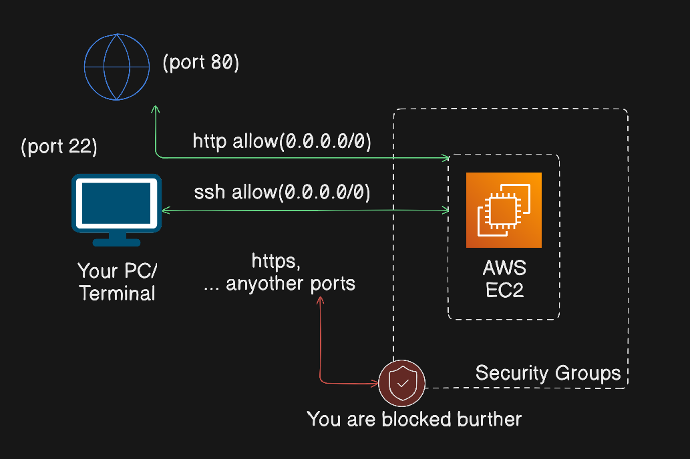

# Day 1 — Deploy Nginx on EC2

## 📌 Overview

Deployed a public web server using AWS EC2 and installed Nginx.

---

## 🏗️ Architecture



EC2 Instance → Security Group → Internet → Browser

---

## ⚙️ Services Used

- EC2
- VPC (default)
- Security Groups

---

## 🚀 Steps

1. Launch EC2 instance (Ubuntu)
2. Allow HTTP & SSH in security group
3. SSH into instance
4. Install Nginx
5. Verify via browser

---

### 2. Server Configuration

Connected via SSH and executed the following commands:

```bash
# Update package list
sudo apt update -y

# Install Nginx
sudo apt install nginx -y

# Start and enable service
sudo systemctl start nginx
sudo systemctl enable nginx
```

---

## 🧪 Verification

Open:
http://public-ip

---

## 📚 Learnings

- Basics of EC2
- Networking fundamentals
- Security groups as firewalls
