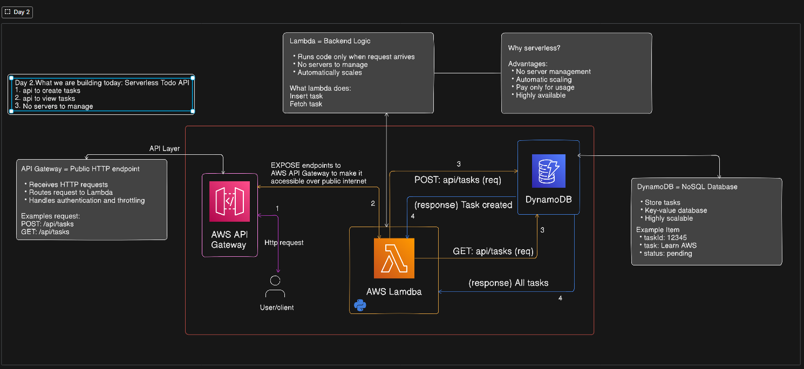

# Day 2 – Serverless Todo API (AWS Lambda + API Gateway + DynamoDB)

This project demonstrates how to build a **serverless REST API** using AWS services.

The API allows users to:

- Create tasks
- Retrieve tasks

The backend is completely **serverless**, meaning no infrastructure management is required.

---

# Architecture



### Architecture Flow

Client
↓
API Gateway (public endpoint)
↓
Lambda Function (backend logic)
↓
DynamoDB (data storage)

---

# AWS Services Used

| Service     | Purpose                |
| ----------- | ---------------------- |
| AWS Lambda  | Runs backend logic     |
| API Gateway | Exposes HTTP endpoints |
| DynamoDB    | Stores tasks           |
| CloudWatch  | Logs and monitoring    |

---

# API Endpoints

### Create Task

POST `/tasks`

Example request:

```bash
curl -X POST https://your-api-url/tasks \
-H "Content-Type: application/json" \
-d '{"task":"Learn AWS Serverless"}'
```

Response

```json
{
  "message": "Task created"
}
```

---

### Get Tasks

GET `/tasks`

Example request

```bash
curl https://your-api-url/tasks
```

Response

```json
[
  {
    "taskId": "1710000000",
    "task": "Learn AWS Serverless",
    "status": "pending"
  }
]
```

---

# Project Structure

```
day02-serverless-todo-api

├── index.py
├── architecture.png
└── README.md
```

---

# Step-by-Step Implementation

## 1 Create DynamoDB Table

Open AWS Console → DynamoDB → Create Table

Configuration

```
Table Name: tasks
Partition Key: taskId (String)
```

---

## 2 Create Lambda Function

Navigate to:

AWS Console → Lambda → Create Function

Settings

```
Runtime: Python 3.12
Function Name: todo-api
Handler: index.handler
```

---

## 3 Add Lambda Code

Create a file named:

```
index.py
```

Paste the following code:

```python
import json
import boto3
import time

dynamodb = boto3.resource("dynamodb")
table = dynamodb.Table("tasks")

def handler(event, context):

    method = event.get("requestContext", {}).get("http", {}).get("method")

    if not method:
        method = event.get("httpMethod")

    if method == "GET":

        response = table.scan()

        return {
            "statusCode": 200,
            "headers": {"Content-Type": "application/json"},
            "body": json.dumps(response.get("Items", []))
        }

    if method == "POST":

        body = event.get("body")

        if body:
            body = json.loads(body)
        else:
            body = {}

        item = {
            "taskId": str(int(time.time())),
            "task": body.get("task", "No Task Provided"),
            "status": "pending"
        }

        table.put_item(Item=item)

        return {
            "statusCode": 200,
            "headers": {"Content-Type": "application/json"},
            "body": json.dumps({
                "message": "Task created",
                "task": item
            })
        }

    return {
        "statusCode": 400,
        "body": json.dumps({"message": "Unsupported method"})
    }
```

---

## 4 Configure Permissions

Attach IAM policy to Lambda:

```
AmazonDynamoDBFullAccess
```

(For production, use a least privilege policy.)

---

## 5 Create API Gateway

Navigate to:

AWS Console → API Gateway → HTTP API → Create

Create routes:

```
GET /tasks
POST /tasks
```

Integrate both routes with the Lambda function.

Deploy the API.

---

# Testing the API

### Create Task

```
curl -X POST https://your-api-url/tasks \
-H "Content-Type: application/json" \
-d '{"task":"Learn AWS"}'
```

### Get Tasks

```
curl https://your-api-url/tasks
```

---

# Logs and Monitoring

All Lambda logs are available in:

CloudWatch → Log Groups

You can use these logs to debug API requests.

---

# Key Learning Outcomes

- Building serverless APIs
- Integrating Lambda with DynamoDB
- Exposing endpoints using API Gateway
- Testing APIs with curl

---

# Next Improvements

Future enhancements could include:

- DELETE /tasks/{taskId}
- Authentication with IAM or Cognito
- Input validation
- Pagination for large datasets

---

# Part of 100 Days of AWS

This project is part of my **100 Days of AWS** challenge where I build real-world cloud projects daily.
