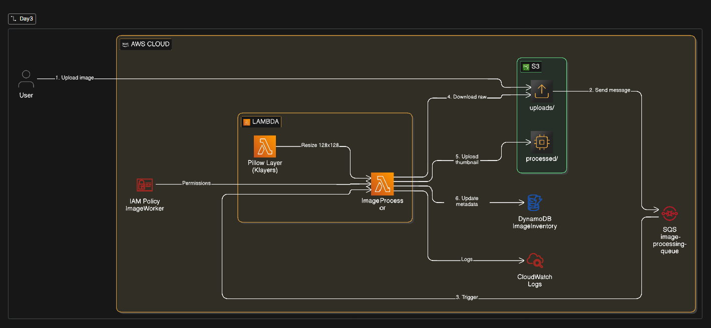

# 🖼️ Serverless Image Processing System

<div align="center">


**A fully decoupled, event-driven image processing pipeline built on AWS.**  
Upload → Queue → Resize → Store. No servers. No waiting.

</div>

---

## 📐 Architecture

<!-- Replace with your architecture image -->



> **Flow:** A message is pushed to SQS → Lambda is triggered → image is downloaded from S3, resized with Pillow → thumbnail is saved back to S3 → DynamoDB is updated with metadata.

---

## ⚡ How It Works

```
User uploads image to S3 (uploads/)
        │
        ▼
SQS receives a message with { id, bucket, key }
        │
        ▼
Lambda polls SQS and triggers automatically
        │
        ▼
Lambda downloads image → resizes to 128×128 via Pillow
        │
        ▼
Thumbnail uploaded to S3 (processed/)
        │
        ▼
DynamoDB updated → Status: RESIZED_SUCCESS
```

---

## 🛠️ Tech Stack

| Service                                                                                                                  | Role                                        |
| ------------------------------------------------------------------------------------------------------------------------ | ------------------------------------------- |
|                     | Stores raw uploads & processed thumbnails   |
|           | Decouples upload events from processing     |
|            | Serverless worker that processes each image |
|  | Tracks image status and processed paths     |
|      | Python library used for resizing images     |

---

## 🚀 Setup & Deployment

### Step 1 — Infrastructure

**S3 Bucket**

- Create a bucket (e.g. `my-image-lab`)
- Create folders: `uploads/` and `processed/`

**SQS Queue**

- Create a **Standard Queue** named `image-processing-queue`
- ⚠️ Set **Visibility Timeout** to `60 seconds`

**DynamoDB Table**

- Table name: `ImageInventory`
- Partition Key: `ImageId` (String)

---

### Step 2 — IAM Role

Create a role named **`ImageWorkerRole`** with the following managed policies:

| Policy                        | Purpose                  |
| ----------------------------- | ------------------------ |
| `AmazonS3FullAccess`          | Read/write images        |
| `AmazonSQSFullAccess`         | Poll and delete messages |
| `AmazonDynamoDBFullAccess`    | Read/write metadata      |
| `AWSLambdaBasicExecutionRole` | Write CloudWatch logs    |

> IAM → Roles → Create Role → AWS Service → Lambda

---

### Step 3 — Lambda Function

- **Name:** `ImageProcessor`
- **Runtime:** Python 3.12
- **Execution Role:** `ImageWorkerRole`
- **Trigger:** SQS → `image-processing-queue`

#### 🔌 Add Pillow Layer (Lambda Layer)

In the Lambda console → **Add a Layer** → **Specify an ARN**:

```
arn:aws:lambda:us-east-1:770693421928:layer:Klayers-p312-Pillow:1
```

> 📍 Update the ARN if you're deploying outside `us-east-1` or using a different Python version. See [Klayers releases](https://github.com/keithrozario/Klayers).

---

### Step 4 — Deploy the Code

#### Phase 1 — Connectivity Test (Copy Only)

Use this to verify SQS → Lambda → S3 plumbing before adding image processing:

```python
import json
import boto3

s3 = boto3.client('s3')
dynamodb = boto3.resource('dynamodb')
table = dynamodb.Table('ImageInventory')

def lambda_handler(event, context):
    for record in event['Records']:
        body = json.loads(record['body'])
        bucket = body['bucket']
        key = body['key']
        image_id = body.get('id', 'unknown')

        # Update DB to Processing
        table.put_item(Item={'ImageId': image_id, 'Status': 'PROCESSING'})

        # Copy file to processed/ as a connectivity test
        new_key = key.replace('uploads/', 'processed/').replace('raw_', 'test_')
        s3.copy_object(Bucket=bucket, CopySource={'Bucket': bucket, 'Key': key}, Key=new_key)

        # Update DB to Completed
        table.update_item(
            Key={'ImageId': image_id},
            UpdateExpression="set #s = :s",
            ExpressionAttributeNames={'#s': 'Status'},
            ExpressionAttributeValues={':s': 'COMPLETED'}
        )
    return {'statusCode': 200}
```

#### Phase 2 — Production Code (Resize with Pillow)

```python
import json
import boto3
import os
from PIL import Image

s3 = boto3.client('s3')
dynamodb = boto3.resource('dynamodb')
table = dynamodb.Table('ImageInventory')

def lambda_handler(event, context):
    for record in event['Records']:
        body = json.loads(record['body'])
        bucket = body['bucket']
        key = body['key']
        image_id = body.get('id', 'unknown')

        # Local paths for processing
        download_path = f"/tmp/{os.path.basename(key)}"
        upload_path = f"/tmp/thumb-{os.path.basename(key)}"

        try:
            # 1. Download
            s3.download_file(bucket, key, download_path)

            # 2. Process (Thumbnail)
            with Image.open(download_path) as img:
                img.thumbnail((128, 128))
                img.save(upload_path)

            # 3. Upload Result
            new_key = key.replace('uploads/', 'processed/').replace('raw_', 'thumb_')
            s3.upload_file(upload_path, bucket, new_key)

            # 4. Update Metadata
            table.update_item(
                Key={'ImageId': image_id},
                UpdateExpression="set #s = :s, #p = :p",
                ExpressionAttributeNames={'#s': 'Status', '#p': 'ProcessedPath'},
                ExpressionAttributeValues={
                    ':s': 'RESIZED_COMPLETED',
                    ':p': f"s3://{bucket}/{new_key}"
                }
            )
        except Exception as e:
            print(f"Error: {str(e)}")
            raise e

    return {'statusCode': 200}
```

---

## 🧪 Testing

**1. Upload an image** to your S3 `uploads/` folder.

**2. Send a message** via SQS → Send Message:

```json
{
  "id": "job001",
  "bucket": "your-bucket-name",
  "key": "uploads/image.jpg"
}
```

**3. Verify results:**

| Where                        | What to check                             |
| ---------------------------- | ----------------------------------------- |
| ✅ DynamoDB `ImageInventory` | `Status` = `RESIZED_COMPLETED`            |
| ✅ S3 `processed/` folder    | Thumbnail file present                    |
| ✅ CloudWatch Logs           | No errors in `/aws/lambda/ImageProcessor` |

---

## 📁 S3 Folder Structure

```
my-image-lab/
├── uploads/
│   └── raw_photo.jpg        ← Original upload
└── processed/
    └── thumb_photo.jpg      ← 128×128 thumbnail
```

---

## ⚙️ Configuration Reference

| Parameter              | Value              |
| ---------------------- | ------------------ |
| SQS Visibility Timeout | `60s`              |
| Lambda Runtime         | `Python 3.12`      |
| Thumbnail Size         | `128 × 128 px`     |
| Lambda Temp Storage    | `/tmp/`            |
| DynamoDB Partition Key | `ImageId` (String) |
