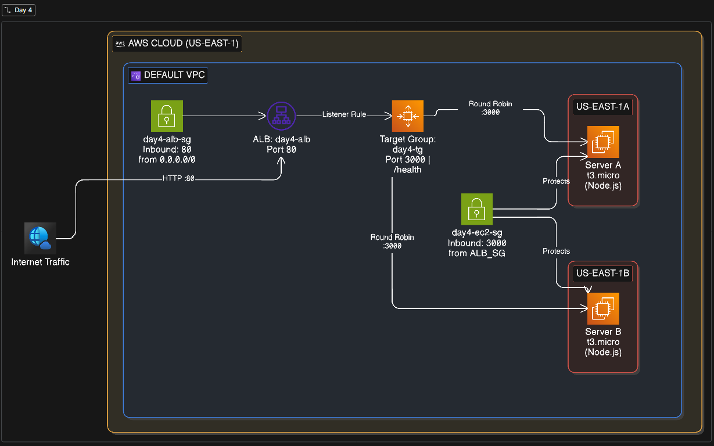

# Day 4 — High Availability Web App on AWS (ALB + EC2)

> **100 Days of Cloud** · Day 4/100  
> Stack: AWS ALB · EC2 (t3.micro) · Node.js · Amazon Linux 2 · KodeKloud Free Lab



---

## What We're Building

Two identical Node.js servers running behind an AWS **Application Load Balancer** — each in a separate Availability Zone. The ALB distributes traffic between them and auto-detects failures via health checks. This is the foundation of every production web app on AWS.

---

## Concepts Covered

| Concept                | What It Means                                                         |
| ---------------------- | --------------------------------------------------------------------- |
| **Load Balancing**     | ALB splits traffic across both EC2s using round-robin                 |
| **High Availability**  | Two AZs — one goes down, the other keeps serving                      |
| **Failover**           | ALB health checks detect the dead instance and reroutes automatically |
| **Security Groups**    | EC2s only accept traffic from the ALB — not the open internet         |
| **Health Checks**      | ALB polls `/health` every 30s to confirm instances are alive          |
| **Horizontal Scaling** | Add more EC2s to the target group — no downtime, no config changes    |

---

## Architecture

```
Internet (Port 80)
        │
        ▼
Application Load Balancer
  (internet-facing · round-robin)
        │
   ┌────┴────┐
   ▼         ▼
EC2 - A    EC2 - B
us-east-1a  us-east-1b
Node.js     Node.js
Port 3000   Port 3000
```

---

## Step 1 — Launch EC2 Instance A

1. Go to **EC2 → Launch Instance**
2. Name it `day4-server-a`
3. AMI: **Amazon Linux 2**
4. Instance type: **t3.micro**
5. Key pair: use existing or create new
6. Network settings:
   - VPC: default
   - Subnet: **us-east-1a**
   - Auto-assign public IP: **Enable**
7. Security Group: create new → name it `day4-ec2-sg`
   - Inbound: **TCP 3000** from `0.0.0.0/0` _(we'll restrict to ALB SG after)_
   - Inbound: **TCP 22** from your IP (SSH)
8. Launch instance

---

## Step 2 — Launch EC2 Instance B

Repeat Step 1 with these changes:

- Name: `day4-server-b`
- Subnet: **us-east-1b**
- Security Group: **reuse** `day4-ec2-sg`

---

## Step 3 — Install Node.js & Deploy on Both Instances

SSH into each instance and run:

```bash
# Connect
ssh -i your-key.pem ec2-user@<PUBLIC_IP>

# Install Node.js
curl -fsSL https://rpm.nodesource.com/setup_18.x | sudo bash -
sudo yum install -y nodejs

# Verify
node -v

# Create app directory
mkdir ~/app && cd ~/app

# Paste server.js here (copy from repo)
nano server.js
```

**Run on Server A:**

```bash
SERVER_NAME="Server A" \
SERVER_COLOR="cyan" \
AZ="us-east-1a" \
REGION="us-east-1" \
INSTANCE_ID="$(curl -s http://169.254.169.254/latest/meta-data/instance-id)" \
node server.js
```

**Run on Server B:**

```bash
SERVER_NAME="Server B" \
SERVER_COLOR="purple" \
AZ="us-east-1b" \
REGION="us-east-1" \
INSTANCE_ID="$(curl -s http://169.254.169.254/latest/meta-data/instance-id)" \
node server.js
```

Test each instance directly:

```bash
curl http://<EC2_PUBLIC_IP>:3000/health
# Expected: OK
```

---

## Step 4 — Create Target Group

1. Go to **EC2 → Target Groups → Create**
2. Target type: **Instances**
3. Name: `day4-tg`
4. Protocol: **HTTP** · Port: **3000**
5. VPC: default
6. Health check:
   - Protocol: HTTP
   - Path: `/health`
   - Healthy threshold: 2
   - Interval: 30s
7. Click **Next → Register targets**
8. Select both `day4-server-a` and `day4-server-b`
9. Click **Include as pending** → **Create target group**

Wait for both targets to show **Healthy** status.

---

## Step 5 — Create Application Load Balancer

1. Go to **EC2 → Load Balancers → Create → Application Load Balancer**
2. Name: `day4-alb`
3. Scheme: **Internet-facing**
4. IP type: IPv4
5. Listeners: **HTTP · Port 80**
6. Availability Zones: select **us-east-1a** and **us-east-1b**
7. Security Group: create new → `day4-alb-sg`
   - Inbound: **TCP 80** from `0.0.0.0/0`
8. Listener default action: **Forward to** `day4-tg`
9. Create load balancer

Copy the **ALB DNS name** — this is your app's URL.

---

## Step 6 — Lock Down EC2 Security Group

Now that the ALB is created, restrict EC2 access to ALB only:

1. Go to `day4-ec2-sg` → Edit inbound rules
2. **Remove** the `0.0.0.0/0` rule on port 3000
3. **Add** new rule: TCP 3000 · Source = `day4-alb-sg`
4. Save

Now EC2s are only reachable through the load balancer.

---

## Step 7 — Demo: Round Robin

Open the ALB DNS in your browser:

```
http://<ALB-DNS-NAME>
```

Refresh the page — you'll see it alternate between **Server A** (cyan) and **Server B** (purple). The page auto-refreshes every 20 seconds so you can watch it switch live.

```bash
# Or use curl in a loop
for i in {1..10}; do curl -s http://<ALB-DNS>/health; echo; done
```

---

## Step 8 — Demo: Failover

1. Go to **EC2 → Instances**
2. Select `day4-server-a` → **Stop instance**
3. Watch the **Target Group** — Server A goes `unhealthy` in ~30s
4. Refresh your browser — **100% of traffic now hits Server B**
5. Start Server A again — it rejoins automatically once health checks pass

This is high availability in action. Zero config change. Zero downtime.

---

## Cleanup

To avoid any charges after the lab:

```
1. Delete ALB          → EC2 → Load Balancers
2. Delete Target Group → EC2 → Target Groups
3. Terminate EC2 A     → EC2 → Instances
4. Terminate EC2 B     → EC2 → Instances
5. Delete Security Groups → day4-alb-sg, day4-ec2-sg
```

---

## Key Takeaways

- An **ALB** is the entry point — EC2s should never be exposed directly to the internet
- **Multi-AZ = High Availability** — always deploy across at least 2 AZs in production
- **Health checks** are what make failover automatic — configure them correctly
- **Round-robin** distributes load evenly — refresh the page to see it switch between servers live
- This same pattern scales to 100s of instances — just register them in the target group

---

_#100DaysOfCloud #AWS #EC2 #ALB #NodeJS #CloudEngineering_
