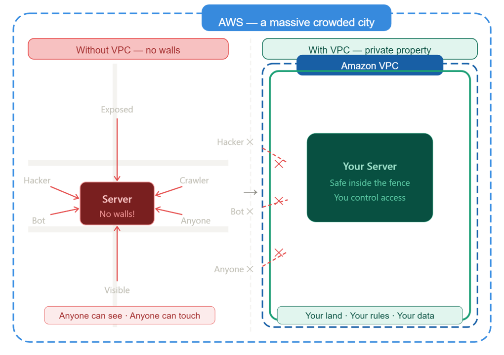
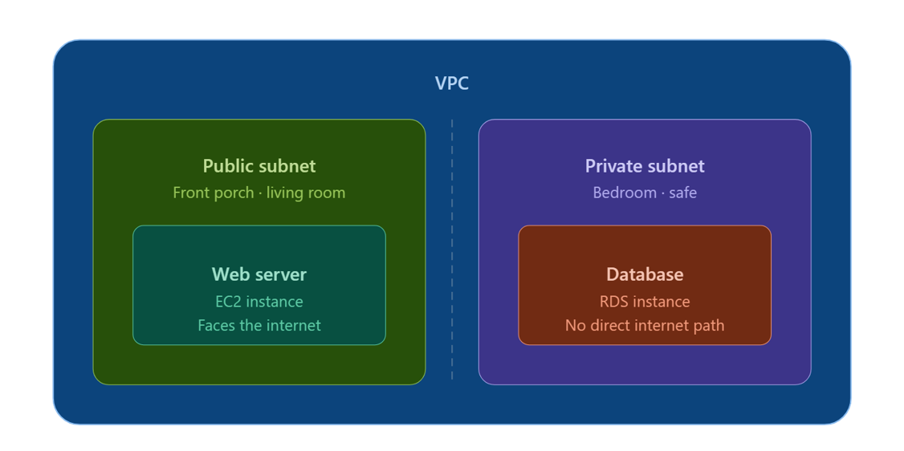
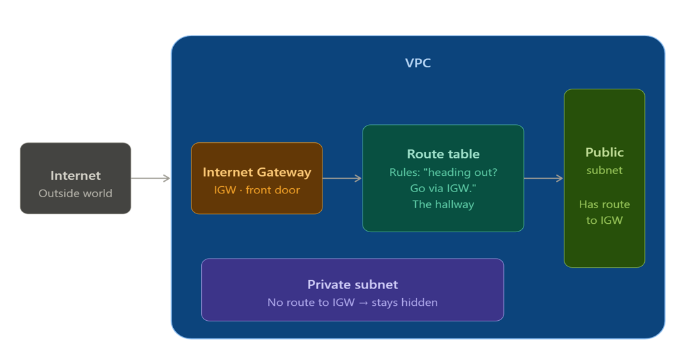
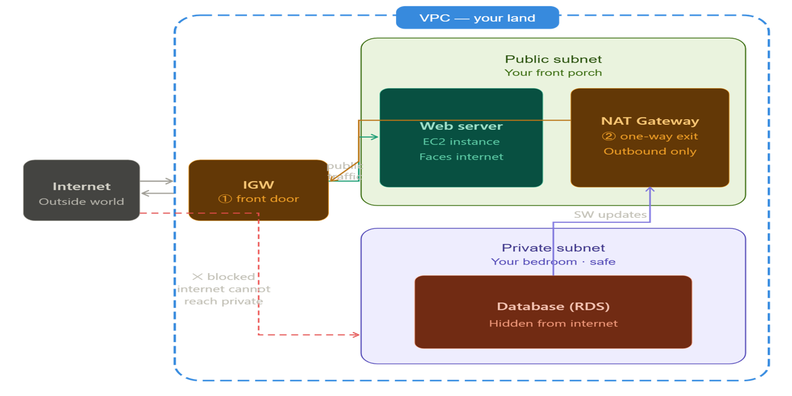

# Day 05: AWS VPC Foundations 🌐🛡️

---

## 📋 Concept Overview

In this project, we move away from the **Default AWS Setup** to build a custom, secure network. Think of a VPC (Virtual Private Cloud) as your **private plot of land** in the massive, crowded city of AWS. Without it, your servers are standing in the middle of a busy street; with it, they are protected behind your own private fence.

---

## 🏗️ Core Components Explained

---

### 1. The Boundary: Virtual Private Cloud (VPC)

<!-- IMAGE: Add your VPC boundary diagram here -->

The VPC is your **Private Property**. It is a logically isolated section of the AWS Cloud where you have full control over:

- **IP Addressing:** Defining your own CIDR blocks (e.g., `10.0.0.0/16`).
- **Isolation:** Ensuring no one can enter your network unless you allow it.

---

### 2. The Rooms: Public vs. Private Subnets

<!-- IMAGE: Add your Public vs Private Subnet diagram here -->

Inside your property, you build different **rooms** for different purposes. These are called **Subnets**.

- **Public Subnet (The Front Porch):** This is where you put your Web Servers. It is designed to talk to the internet. If a user wants to see your website, they "walk onto the porch."
- **Private Subnet (The Vault):** This is where your Databases live. There is no direct path from the internet to this room. It stays hidden and secure.

---

### 3. The Front Door: Internet Gateway (IGW)

<!-- IMAGE: Add your IGW and Route Table diagram here -->

An **Internet Gateway** is the "Front Door" of your VPC.

- Without an IGW, your VPC is a closed box with no internet access.
- **Route Tables** act as the "Hallways," directing traffic from your Public Subnet to the Front Door so your website can be reached by the world.

---

### 4. The One-Way Mirror: NAT Gateway

<!-- IMAGE: Add your NAT Gateway full architecture diagram here -->

What if a server in your Private Subnet (The Vault) needs a software update? It can't use the Front Door (IGW) because that would expose it to the public.

We use a **NAT Gateway**.

- It acts as a **one-way mirror**.
- It allows your private resources to **reach out** to the internet for updates but **blocks** anyone from the internet from reaching back into the private subnet.

---

## 🚀 Why This Matters (The "NoCap" Summary)

| #   | Benefit         | Why                                                                                    |
| --- | --------------- | -------------------------------------------------------------------------------------- |
| 1   | **Security**    | You keep your data (Databases) in the "Vault" where hackers can't see them.            |
| 2   | **Control**     | You decide exactly how traffic flows using Route Tables.                               |
| 3   | **Scalability** | You build a professional-grade network that mimics real-world enterprise environments. |

---

> 💡 **Key Takeaway:** VPC = your land · Subnets = your rooms · IGW = your front door · NAT Gateway = your one-way security exit.
