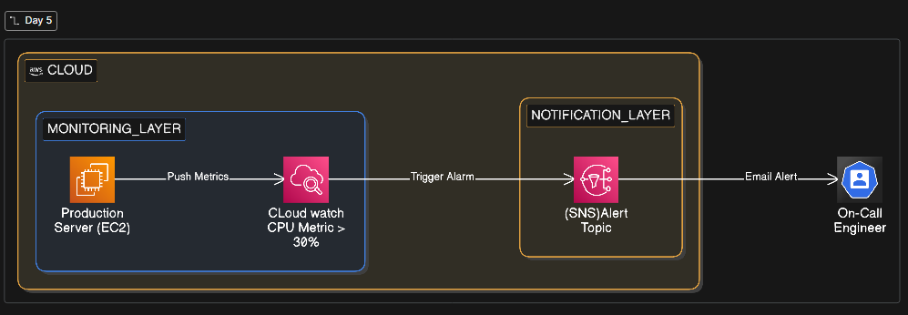

# Day 06: Automated Infrastructure Monitoring & Alerting 🚀

## 📋 Project Overview

In a production environment, manual monitoring is unscalable and leads to downtime. This project implements an **Automated Infrastructure Monitoring Pipeline** using **Amazon CloudWatch** and **Amazon SNS**.

We use a custom stress-testing script to simulate a "High CPU Utilization" incident on a production web server. This triggers an automated alarm that notifies the DevOps team via email, enabling a <5 minute **Mean Time to Detect (MTTD)**.

## 🏗️ Architecture



The monitoring pipeline follows this flow:

1.  **Amazon EC2**: The target "Production" instance.
2.  **CloudWatch Metrics**: Collects real-time CPU utilization data.
3.  **CloudWatch Alarm**: Evaluates metrics against a >70% threshold.
4.  **Amazon SNS**: Dispatches the alert to the defined subscriber group.
5.  **Email Notification**: Instant notification delivered to the engineer.

---

## 🛠️ Tech Stack

- **Cloud:** Amazon Web Services (AWS)
- **Services:** EC2, CloudWatch, SNS
- **Automation:** Bash Scripting (`stress_test.sh`)
- **Concepts:** Observability, Threshold-based Alerting, Incident Response

---

## 🚀 Step-by-Step Implementation

### Phase 1: Configure Notification Hub (SNS)

1.  Navigate to **Amazon SNS** > **Topics** > **Create Topic**.
2.  Select **Standard** type and name it `DevOps-Critical-Alerts`.
3.  Create a **Subscription**:
    - **Protocol:** Email.
    - **Endpoint:** Your-email@example.com.
4.  **Action Required:** Confirm the subscription via the link sent to your email.

### Phase 2: Launch & Tag the Instance

1.  Launch an EC2 instance (Amazon Linux 2023, t2.micro).
2.  **Tagging:** Use `Name: Prod-Web-Server-01`.
3.  Ensure the Security Group allows SSH (Port 22) from your IP.

### Phase 3: Create the CloudWatch Alarm

1.  Open **CloudWatch** > **Alarms** > **Create Alarm**.
2.  **Select Metric:** `EC2 > Per-Instance Metrics > CPUUtilization`.
3.  **Conditions:**
    - **Threshold:** Static, Greater than 70%.
    - **Evaluation Period:** 1 out of 1 (for immediate demo feedback).
4.  **Notification:** Select the `DevOps-Critical-Alerts` SNS topic.

### Phase 4: Automated Stress Testing

Instead of running manual commands, we use a bash script to simulate a heavy load consistently.

1.  **Create the script:**
    ```bash
    cat << 'EOF' > stress_test.sh
    #!/bin/bash
    echo "🚀 Starting DevOps Stress Test..."
    sudo yum install stress -y
    echo "🔥 Triggering CPU spike (70%+ load) for 5 minutes..."
    stress --cpu 4 --timeout 300
    EOF
    ```
2.  **Execute the test:**
    ```bash
    chmod +x stress_test.sh
    ./stress_test.sh
    ```

---

## 📊 Results & Validation

- **Metric Spike:** Monitor the CloudWatch graph as the `stress` tool maxes out CPU cores.
- **State Change:** The alarm will transition from `OK` → `ALARM`.
- **Alert Delivery:** Verify the automated email alert containing the incident timestamp and instance ID.

---

## 💡 Key Learnings

- **Reducing MTTD:** How automation replaces manual dashboard watching.
- **Alarm Fatigue:** The importance of tuning thresholds (e.g., using 2/3 datapoints in production) to avoid false positives.
- **Decoupled Architecture:** Using SNS allows the same alarm to trigger emails, Slack messages, and Lambda functions simultaneously.

## 📂 Repository Structure

```bash
day06-cloudwatch-alarms/
├── architecture.png        # Infrastructure Diagram
├── README.md               # Project Documentation
└── scripts/
    └── stress_test.sh      # Automation script for CPU load simulation
```
