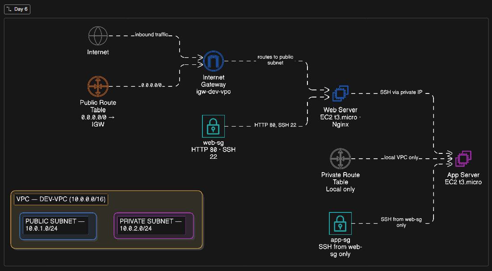

# Day 07: Building a Production-Grade VPC 🛠️💻

## 📋 Project Overview

In AWS, launching everything into a default VPC is a security risk. This project implements a **production-grade Virtual Private Cloud (VPC)** with isolated public and private subnets, a custom route table, and an Internet Gateway — the foundational networking layer every real AWS workload runs on.

A web server in the **public subnet** is accessible from the internet via the Internet Gateway. An app server in the **private subnet** has no direct internet exposure, communicating only within the VPC — simulating a real 2-tier architecture.

## 🏗️ Architecture



The traffic flow follows this path:

1. **Internet Gateway**: Entry point for all inbound internet traffic.
2. **Public Subnet (10.0.1.0/24)**: Hosts the web server. Has a route to the IGW.
3. **Public Route Table**: Routes `0.0.0.0/0` → Internet Gateway.
4. **Private Subnet (10.0.2.0/24)**: Hosts the app server. No internet route — internal only.
5. **Private Route Table**: Local VPC traffic only (`10.0.0.0/16`).
6. **Security Groups**: Control inbound/outbound traffic at the instance level.

---

## 🛠️ Tech Stack

- **Cloud:** Amazon Web Services (AWS)
- **Services:** VPC, EC2, Internet Gateway, Route Tables, Security Groups, Subnets
- **OS:** Amazon Linux 2023
- **Concepts:** Network Isolation, Subnet Design, Routing, Security Groups

---

## 🚀 Step-by-Step Implementation

### Phase 1: Create the VPC

1. Navigate to **VPC** > **Your VPCs** > **Create VPC**.
2. Configure:
   - **Name:** `dev-vpc`
   - **IPv4 CIDR:** `10.0.0.0/16`
   - **Tenancy:** Default
3. Click **Create VPC**.

---

### Phase 2: Create Subnets

#### Public Subnet

1. Go to **Subnets** > **Create Subnet**.
2. Select `dev-vpc`.
3. Configure:
   - **Name:** `public-subnet-01`
   - **Availability Zone:** `ap-south-1a` _(or your region)_
   - **IPv4 CIDR:** `10.0.1.0/24`
4. After creation, select the subnet > **Actions** > **Edit subnet settings** > Enable **Auto-assign public IPv4 address**.

#### Private Subnet

1. Create another subnet in the same VPC.
2. Configure:
   - **Name:** `private-subnet-01`
   - **Availability Zone:** `ap-south-1a`
   - **IPv4 CIDR:** `10.0.2.0/24`
3. Do **NOT** enable auto-assign public IP.

---

### Phase 3: Create & Attach Internet Gateway

1. Go to **Internet Gateways** > **Create Internet Gateway**.
2. **Name:** `igw-dev-vpc`.
3. After creation, click **Actions** > **Attach to VPC** > select `dev-vpc`.

---

### Phase 4: Configure Route Tables

#### Public Route Table

1. Go to **Route Tables** > **Create Route Table**.
2. Configure:
   - **Name:** `public-rt`
   - **VPC:** `dev-vpc`
3. Select `public-rt` > **Routes** tab > **Edit routes** > **Add route**:
   - **Destination:** `0.0.0.0/0`
   - **Target:** `igw-dev-vpc`
4. Go to **Subnet Associations** tab > **Edit subnet associations** > select `public-subnet-01`.

#### Private Route Table

1. Create another route table:
   - **Name:** `private-rt`
   - **VPC:** `dev-vpc`
2. Associate it with `private-subnet-01`.
3. Leave routes as **local only** — no internet route.

---

### Phase 5: Create Security Groups

#### Web Server Security Group (Public)

1. Go to **Security Groups** > **Create Security Group**.
2. Configure:
   - **Name:** `web-sg`
   - **VPC:** `dev-vpc`
3. **Inbound rules:**
   - HTTP (Port 80) — Source: `0.0.0.0/0`
   - SSH (Port 22) — Source: `Your IP/32`
4. **Outbound rules:** All traffic (default).

#### App Server Security Group (Private)

1. Create another security group:
   - **Name:** `app-sg`
   - **VPC:** `dev-vpc`
2. **Inbound rules:**
   - SSH (Port 22) — Source: `web-sg` _(only the web server can SSH in)_
   - All ICMP — Source: `10.0.1.0/24` _(allow ping from public subnet)_
3. **Outbound rules:** All traffic (default).

---

### Phase 6: Launch EC2 Instances

#### Web Server (Public Subnet)

1. Launch EC2: Amazon Linux 2023, `t3.micro`.
2. Configure:
   - **Network:** `dev-vpc`
   - **Subnet:** `public-subnet-01`
   - **Auto-assign Public IP:** Enable
   - **Security Group:** `web-sg`
   - **Tag:** `Name: Web-Server-Public`
3. In **User Data**, paste:
   ```bash
   #!/bin/bash
   yum update -y
   yum install -y nginx
   systemctl start nginx
   systemctl enable nginx
   echo "<h1>Day 06 - Public Web Server | VPC Demo</h1>" > /usr/share/nginx/html/index.html
   ```

#### App Server (Private Subnet)

1. Launch EC2: Amazon Linux 2023, `t3.micro`.
2. Configure:
   - **Network:** `dev-vpc`
   - **Subnet:** `private-subnet-01`
   - **Auto-assign Public IP:** Disable
   - **Security Group:** `app-sg`
   - **Tag:** `Name: App-Server-Private`

---

### Phase 7: Validate the Architecture

#### Test 1 — Public Web Server is reachable

```bash
# From your local machine
curl http://<Web-Server-Public-IP>
# Expected: <h1>Day 06 - Public Web Server | VPC Demo</h1>
```

#### Test 2 — Private Server has no internet access

```bash
# SSH into Web Server first
ssh -i your-key.pem ec2-user@<Web-Server-Public-IP>

# From Web Server, SSH into App Server using private IP
ssh -i your-key.pem ec2-user@10.0.2.x

# From App Server, try to reach the internet
curl https://google.com
# Expected: Connection timeout — no route to internet ✅
```

#### Test 3 — Ping between subnets works

```bash
# From Web Server
ping 10.0.2.x
# Expected: Ping replies — VPC internal routing works ✅
```

---

## 📊 Results & Validation

| Test                                 | Expected Result       | Status |
| ------------------------------------ | --------------------- | ------ |
| HTTP to Web Server public IP         | Nginx page loads      | ✅     |
| SSH to App Server from Web Server    | Connection successful | ✅     |
| Internet access from private subnet  | Connection timeout    | ✅     |
| Ping between public ↔ private subnet | ICMP replies          | ✅     |

---

## 💡 Key Learnings

- **Subnet isolation**: Public and private subnets are just route table assignments — the IGW route is what makes a subnet "public".
- **Security Groups as firewalls**: Using `web-sg` as the SSH source for `app-sg` is a best practice — no IP hardcoding needed.
- **Route tables are the brain**: Every subnet's internet behaviour is entirely determined by its route table association.
- **No NAT Gateway needed for this demo**: Private instances don't need internet access here — a real production setup would add a NAT Gateway for outbound-only access (e.g. package installs).

---

## 📂 Repository Structure

```bash
day06-vpc-architecture/
├── architecture.png          # Infrastructure diagram
├── README.md                 # Project documentation
└── scripts/
    └── userdata-webserver.sh # Nginx bootstrap script
```
