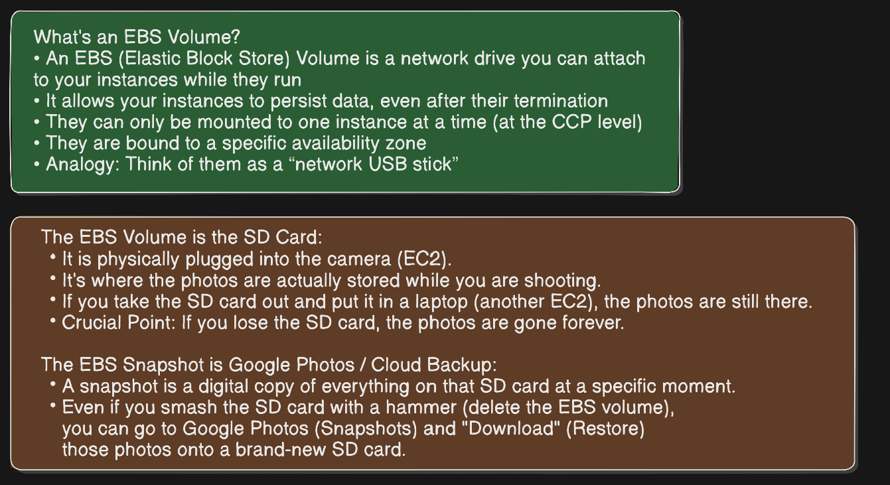
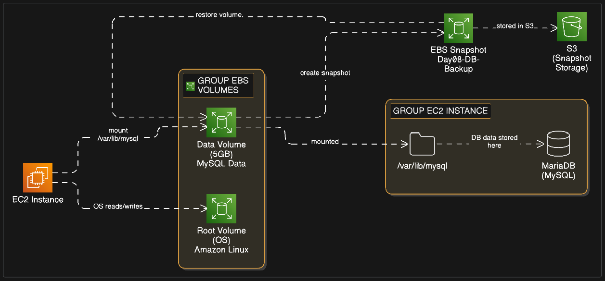
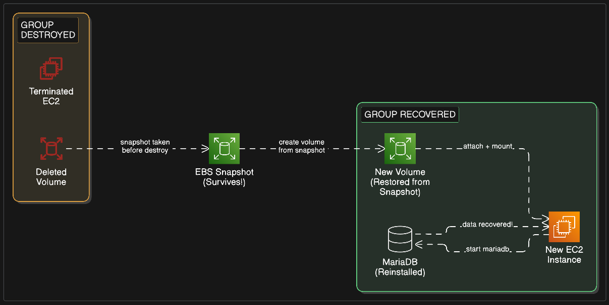

# Day 08: Database Persistence with EBS Snapshots 🗄️

---

## Overview of EBS and EBS Snapshot

> 

## 📌 Project Overview

In this project, we level up! We aren't just saving files — we are saving a **MySQL Database**. We will install a database engine, store data on a secondary EBS volume, "destroy" the server, and recover the database state using an EBS Snapshot.

---

## 📖 Architecture

>  > First phase we take backup of the server

>  > Second phase we destroy the server and restore the backup from first phase

| Component         | Role                                |
| ----------------- | ----------------------------------- |
| EC2 Instance      | The compute engine                  |
| EBS Volume (Root) | Holds the OS (Amazon Linux)         |
| EBS Volume (Data) | Secondary 5GB volume for MySQL data |
| Snapshots         | Backup stored in S3                 |

> 💡 **Why a separate volume for the DB?** In production, we keep data separate from the OS. If the OS crashes or needs an upgrade, your data remains safe on its own disk.

---

## 🛠️ Step-by-Step Implementation

### Phase 1: Setup & Volume Preparation

1. Launch an EC2 instance.
2. Create a **5GB EBS Volume** (select type /dev/xvdbf) and attach it to your instance.
3. Identify and format the drive:

```bash
lsblk                        # Find your disk name (e.g., nvme1n1 or sdb)
sudo mkfs -t xfs /dev/nvme1n1    # Format the new 5GB volume
```

4. Mount the drive to the MySQL data directory:

```bash
sudo mkdir -p /var/lib/mysql
sudo mount /dev/nvme1n1 /var/lib/mysql
```

> ⚠️ **You cannot skip the mount step.**
>
> - **EBS Volume** = the physical hard drive
> - **Attach** = plugging the cable into the computer
> - **Mount** = telling the OS "use this folder to talk to that hard drive"

---

### Phase 2: Install & Configure MySQL (MariaDB)

```bash
sudo dnf update -y
sudo dnf install mariadb105-server -y
sudo systemctl start mariadb
sudo systemctl enable mariadb
```

---

### Phase 3: Populate the Database

```sql
-- Enter MySQL shell: sudo mysql

CREATE DATABASE company_db;
USE company_db;

CREATE TABLE employees (
    id INT AUTO_INCREMENT PRIMARY KEY,
    name VARCHAR(50),
    position VARCHAR(50),
    created_at TIMESTAMP DEFAULT CURRENT_TIMESTAMP
);

INSERT INTO employees (name, position) VALUES
('Priyanshu', 'Cloud Engineer'),
('John Doe', 'DevOps Intern'),
('Jane Smith', 'SRE');

SELECT * FROM employees;
```

---

### Phase 4: Take the Snapshot (Backup)

1. Flush and lock MySQL to finish writing to disk.
2. Go to **AWS Console → EC2 → Snapshots → Create Snapshot**.
3. Select the **5GB Data Volume**.
4. Tag it: `Day08-DB-Backup`.

---

### Phase 5: Disaster & Recovery

1. **Terminate** the EC2 instance and **delete** the volumes.
2. Restore:
   - Create a **new volume** from your Snapshot.
   - Launch a **new EC2 instance**.
   - Install MariaDB: `sudo dnf install mariadb105-server -y`
   - **Attach** the restored volume.
   - **Mount it:** `sudo mount /dev/nvme1n1 /var/lib/mysql`
   - **Start MariaDB:** `sudo systemctl start mariadb`

---

### Phase 6: The Proof

```sql
USE company_db;
SELECT * FROM employees;
```

**Your data is back!** 🚀

---

## 💡 Key Concept: Snapshots vs. AMIs

|                      | EBS Snapshot                | AMI (Image)                        |
| -------------------- | --------------------------- | ---------------------------------- |
| **What it backs up** | A single disk               | The entire machine                 |
| **Use case**         | Databases, logs, user files | Clone the full OS + software setup |
| **Restore to**       | A new EBS volume            | A new EC2 instance                 |

---

## 📺 Video Link

| Day | Project                                 | Services Used       | Status       | Link                           |
| --- | --------------------------------------- | ------------------- | ------------ | ------------------------------ |
| 08  | Database Persistence with EBS Snapshots | EC2, EBS, Snapshots | ✅ Completed | [▶ Watch](https://youtube.com) |
