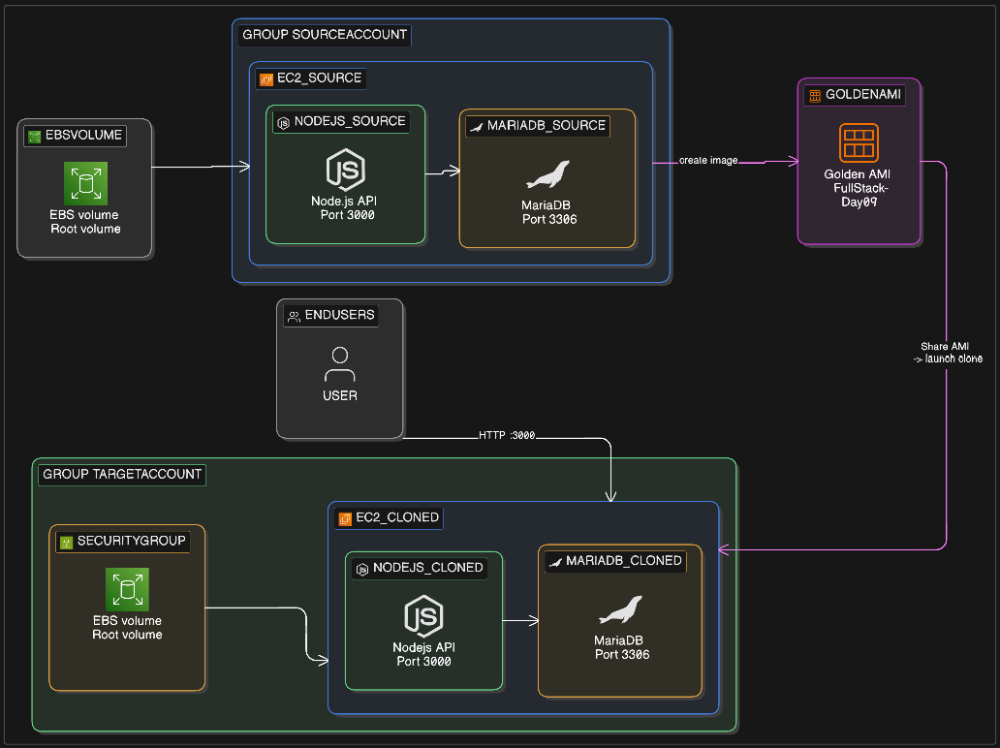

# Day 09: Full-Stack Cloning with Amazon Machine Images (AMI) 🚀

## 📌 Project Overview

In Day 08, we handled manual data recovery. Today, we master **Server Portability**. We are building a "Golden Image" of a full-stack environment. This isn't just a backup; it's a pre-configured template that includes the OS, the Database, the Node.js runtime, and our Application code.

We will create this "Golden Image" in one AWS account and launch a perfect, running clone in a **different** AWS account.

> 

---

## 📖 Theory: Why AMIs over Snapshots?

While an EBS Snapshot saves your **data**, an AMI saves your **entire ecosystem**.

| Feature  | EBS Snapshot                 | AMI                      |
| -------- | ---------------------------- | ------------------------ |
| Saves    | Data only                    | Entire ecosystem         |
| Usage    | Manual volume attach & mount | Launch instance directly |
| Software | Must reinstall manually      | Pre-installed & ready    |
| Use Case | Data backup                  | Full environment clone   |

- **Snapshots:** You have to manually create a volume, attach it, mount it, and install software to use the data.
- **AMIs:** You launch an instance, and **everything** (MySQL, Node.js, Configs) is already there and running.

---

## 🏗️ The Golden Stack

| Layer    | Technology                                      |
| -------- | ----------------------------------------------- |
| OS       | Amazon Linux 2023                               |
| Database | MariaDB (MySQL)                                 |
| Runtime  | Node.js                                         |
| App      | Node.js API connecting to local DB on Port 3000 |

---

## 🛠️ Step-by-Step Implementation

### Phase 1: Prepare the Source Server

#### Step 1 — Update and Install the Stack

```bash
sudo dnf update -y
sudo dnf install -y mariadb105-server nodejs
sudo systemctl start mariadb && sudo systemctl enable mariadb
```

---

#### Step 2 — Secure the Database for Node.js

> ⚠️ **Troubleshooting Tip:** By default, MariaDB 10.5+ uses `unix_socket` authentication. Node.js connects as a **network client**, not a system user, so it cannot use socket auth. Without this fix, your app will throw an **"Access Denied"** error even with the correct password.

Log into MariaDB:

```bash
sudo mysql -u root
```

Inside the MariaDB shell, run:

```sql
-- Replace 'MyNodePassword' with your actual secure password
ALTER USER 'root'@'localhost' IDENTIFIED VIA mysql_native_password USING PASSWORD('MyNodePassword');

CREATE DATABASE inventory_db;
USE inventory_db;

CREATE TABLE products (
  id    INT AUTO_INCREMENT PRIMARY KEY,
  name  VARCHAR(50),
  stock INT
);

INSERT INTO products (name, stock) VALUES
  ('AWS Cloud Guru T-Shirt', 50),
  ('DevOps Mug', 25);

FLUSH PRIVILEGES;
EXIT;
```

---

#### Step 3 — Deploy the API

```bash
mkdir my-app && cd my-app
npm init -y
npm install mysql2
```

Create `server.js`:

```javascript
const http = require("http");
const mysql = require("mysql2");

const connection = mysql.createConnection({
  host: "localhost",
  user: "root",
  password: "MyNodePassword", // Use the password you set in Step 2
  database: "inventory_db",
});

const server = http.createServer((req, res) => {
  if (req.url === "/products") {
    connection.query("SELECT * FROM products", (err, results) => {
      if (err) {
        res.writeHead(500, { "Content-Type": "application/json" });
        res.end(
          JSON.stringify({ error: "DB Connection Failed", details: err })
        );
        return;
      }
      res.writeHead(200, { "Content-Type": "application/json" });
      res.end(JSON.stringify(results));
    });
  } else {
    res.writeHead(200, { "Content-Type": "text/plain" });
    res.end("Day 09 Golden Image API! Visit /products");
  }
});

server.listen(3000, () => console.log("Server running on port 3000"));
```

---

#### Step 4 — Test the Source Server

```bash
node server.js &
```

Visit in your browser:

```
http://<Your-Public-IP>:3000/products
```

You should see your product data returned as JSON.

---

### Phase 2: Create the "Golden Image"

1. Go to **EC2 Console** → **Instances**
2. Select your instance → **Actions** → **Image and templates** → **Create image**
3. Set **Name** to: `FullStack-Golden-Image-Day09`
4. ✅ Ensure **"Tag image and snapshots together"** is checked
5. Click **Create image** and wait for the AMI status to become `available`

---

### Phase 3: Cross-Account Sharing

1. Go to **Images** → **AMIs**
2. Select your AMI → **Actions** → **Edit AMI permissions**
3. Under **Shared accounts**, click **Add account ID**
4. Enter the **AWS Account ID** of your target account
5. Click **Save changes**

---

### Phase 4: Launch the Clone in the Second Account

1. Log into your **second AWS account**
2. Navigate to **EC2** → **AMIs**
3. Filter by **"Shared with me"**
4. Select `FullStack-Golden-Image-Day09` → **Launch instance from AMI**
5. Configure the instance (ensure the **Security Group** allows **inbound TCP on Port 3000**)
6. Launch and SSH into the new server

**Verify the clone:**

```bash
# Your app directory is already there
ls ~/my-app

# MariaDB is already running
sudo systemctl status mariadb

# Start the API and test
cd ~/my-app && node server.js &
curl http://localhost:3000/products
```

It works instantly — no reinstallation, no configuration! ✅

---

## EBS Snapshot vs. AMI: Quick Comparison

| Feature          | EBS Snapshot                               | AMI (Amazon Machine Image)                       |
| :--------------- | :----------------------------------------- | :----------------------------------------------- |
| **What is it?**  | A point-in-time copy of a **single** disk. | A blueprint/template for an **entire** server.   |
| **Bootable?**    | **No.** (Must be attached to an instance)  | **Yes.** (Can launch new instances directly)     |
| **Best For**     | Routine data backups and "undo" points.    | Auto Scaling, Disaster Recovery, and Migrations. |
| **Relationship** | The **"Ingredient"** (Data only).          | The **"Finished Meal"** (OS + Data + Config).    |

---

## When to use which?

### 💾 Use a Snapshot when...

You are performing a **Database Upgrade** or making risky changes to a filesystem.

- **Workflow:** Snapshot the volume right before you start. If the upgrade fails or data gets corrupted, you can quickly create a new volume from that snapshot and swap it back in.

### 🚀 Use an AMI when...

You have finished configuring your **Node.js environment** and need to move it from "Testing" to "Production."

- **Workflow:** You "bake" the AMI to capture the OS, installed packages, and configuration. You then share this "Golden Image" across accounts to ensure your production environment is an identical clone of what you tested.

---

## 🧪 Key Learning Points

### 1. Authentication Plugins Matter

MariaDB 10.5+ defaults to `unix_socket` auth. External applications like Node.js use TCP/IP sockets, not system sockets. Switching to `mysql_native_password` via `ALTER USER` is the critical fix that enables password-based login for your app.

### 2. Eliminating Environmental Drift

"It works on my machine" is a real problem in production. AMIs capture the **entire environment state** — OS, packages, configs, and code — ensuring every clone is byte-for-byte identical.

### 3. Build Clean, Update First

Always run `sudo dnf update -y` **before** creating a Golden Image. This bakes the latest security patches into every instance launched from it, reducing your attack surface from day zero.

---

## 📁 Project Structure

```
my-app/
└── server.js       # Node.js HTTP API
```

---

## 🔐 Security Reminder

> Do **not** hardcode passwords in `server.js` for production. Use **AWS Secrets Manager** or **environment variables** instead.

---
