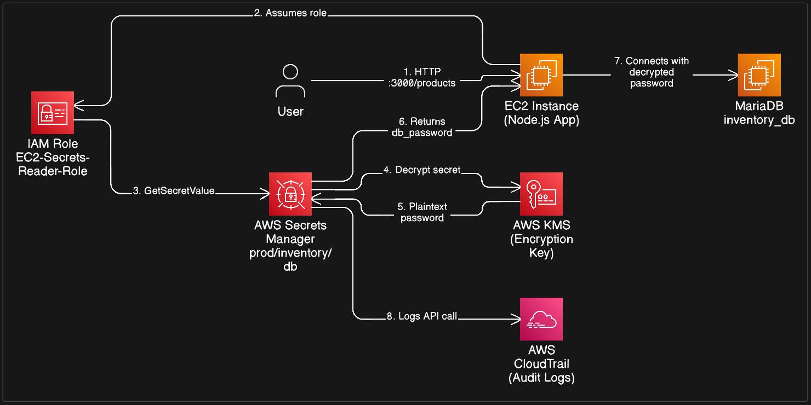

# Day 10 — Decoupling Credentials with AWS Secrets Manager 🔐

Remove hardcoded passwords from your Node.js application and fetch credentials securely at runtime using AWS Secrets Manager, IAM Roles, and the AWS SDK v3.

---

## Overview

In Day 09 [Watch on YouTube](https://youtu.be/5ukuGQvCuvo), our application stored the database password as plaintext inside `server.js`. This is a critical security flaw — if the code reaches GitHub or the AMI is shared, credentials are exposed.

> 

This project eliminates that risk. Secrets are stored in AWS Secrets Manager and retrieved dynamically at runtime. The password never appears in source code, on disk, or in Git history.

---

## The Problem: Hardcoded vs. Dynamic Secrets

| Feature      | Hardcoded Credentials         | AWS Secrets Manager         |
| ------------ | ----------------------------- | --------------------------- |
| Visibility   | Visible in source code / Git  | Retrieved only via API call |
| Rotation     | Manual, requires redeployment | Automatic, zero downtime    |
| Auditability | None                          | Logged via AWS CloudTrail   |
| Compliance   | Fails most security audits    | Meets SOC, HIPAA, PCI-DSS   |

---

## Tech Stack

| Layer          | Technology                    |
| -------------- | ----------------------------- |
| Secret store   | AWS Secrets Manager           |
| Access control | IAM Role (EC2 Execution Role) |
| Application    | Node.js with AWS SDK v3       |
| Database       | MariaDB running on EC2        |

---

## Project Structure

```
my-app/
├── node_modules/
├── package.json
└── server.js       # Secure Node.js API — no hardcoded secrets
```

---

## Prerequisites

- An EC2 instance from Day 09 with MariaDB and Node.js installed
- AWS CLI configured, or an IAM Role attached to the instance
- MariaDB database `inventory_db` with a `products` table

---

## Implementation

### Phase 1 — Store the Secret in AWS

1. Go to **AWS Secrets Manager** → _Store a new secret_.
2. Select _Other type of secret_ and add the following key/value pair:

   | Field       | Value               |
   | ----------- | ------------------- |
   | Key         | `db_password`       |
   | Value       | `MyNodePassword`    |
   | Secret name | `prod/inventory/db` |

3. Leave all other settings as default and click **Store**.

---

### Phase 2 — Grant Permissions via IAM Role

> **Note:** Never use IAM Access Keys on EC2 instances. Attach an IAM Role instead — the AWS SDK handles temporary credentials automatically.

1. Go to **IAM → Roles → Create role**. Select _AWS Service → EC2_.

2. Attach the following custom policy (replace `REGION` and `ACCOUNT_ID` with your values):

```json
{
  "Version": "2012-10-17",
  "Statement": [
    {
      "Effect": "Allow",
      "Action": "secretsmanager:GetSecretValue",
      "Resource": "arn:aws:secretsmanager:REGION:ACCOUNT_ID:secret:prod/inventory/db-*"
    }
  ]
}
```

3. Name the role `EC2-Secrets-Reader-Role` and **attach it to your EC2 instance**.

---

### Phase 3 — Update the Application

**Step 1 — Install the AWS SDK:**

```bash
cd ~/my-app
npm install @aws-sdk/client-secrets-manager
```

**Step 2 — Replace the contents of `server.js`:**

```javascript
const http = require("http");
const mysql = require("mysql2/promise");
const {
  SecretsManagerClient,
  GetSecretValueCommand,
} = require("@aws-sdk/client-secrets-manager");

const secret_name = "prod/inventory/db";
const client = new SecretsManagerClient({ region: "us-east-1" }); // update your region

async function getPassword() {
  const response = await client.send(
    new GetSecretValueCommand({ SecretId: secret_name })
  );
  const secrets = JSON.parse(response.SecretString);
  return secrets.db_password;
}

async function startServer() {
  const dbPassword = await getPassword();

  const pool = mysql.createPool({
    host: "localhost",
    user: "root",
    password: dbPassword,
    database: "inventory_db",
  });

  const server = http.createServer(async (req, res) => {
    if (req.url === "/products") {
      try {
        const [rows] = await pool.query("SELECT * FROM products");
        res.writeHead(200, { "Content-Type": "application/json" });
        res.end(JSON.stringify(rows));
      } catch (err) {
        res.writeHead(500);
        res.end(JSON.stringify({ error: "DB Error" }));
      }
    } else {
      res.end("Day 10: Secrets Managed Successfully!");
    }
  });

  server.listen(3000, () => console.log("Secure Server running on port 3000"));
}

startServer().catch(console.error);
```

---

### Phase 4 — Run and Verify

Start the server:

```bash
node server.js
```

Test the endpoint:

```bash
curl http://<Public-IP>:3000/products
```

> **Success indicator:** If you receive product data in the response, the app successfully used IAM to authenticate, called Secrets Manager over HTTPS, decrypted the password in memory, and queried MariaDB — without the password ever touching disk or Git history.

---

## Key Concepts

### 1. Runtime Secret Retrieval

Secrets are fetched at startup, keeping the application stateless with respect to sensitive data. Update the password in the AWS Console and the app picks it up on the next restart (or next request, if you add caching logic).

### 2. IAM Roles over IAM Users

No `AWS_ACCESS_KEY_ID` or `AWS_SECRET_ACCESS_KEY` is used. An IAM Role attached to the EC2 instance provides short-lived, automatically rotated temporary credentials via the Instance Metadata Service (IMDS). This is the industry-standard approach for EC2 workloads.

### 3. Encryption at Rest and in Transit

Secrets Manager encrypts stored values using AWS KMS. The secret is only decrypted when explicitly requested by an authorized caller over an encrypted HTTPS connection — it is never stored in plaintext.

---

## What's Next

**Day 11 — Availability:** The single EC2 instance will be moved into an **Auto Scaling Group** so the infrastructure can self-heal automatically when a server fails.

---

## Series Navigation

| Day        | Topic                                               |
| ---------- | --------------------------------------------------- |
| Day 09     | Building a Golden AMI                               |
| **Day 10** | **Decoupling Credentials with AWS Secrets Manager** |
| Day 11     | Auto Scaling Groups & High Availability             |
