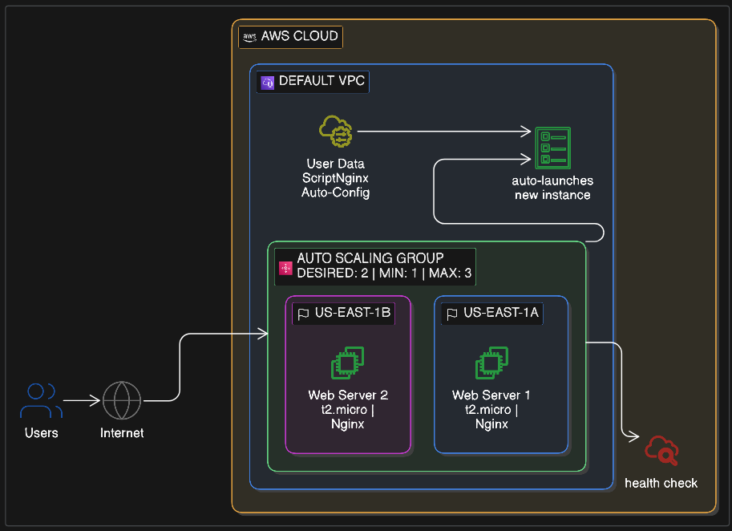

# Day 11: Building a Self-Healing Fleet with Auto Scaling & User Data 🚀

> **From "Pet" servers we fix manually — to "Cattle" that replace themselves automatically.**

---

## 📌 Project Overview

In **Day 10**, we secured our servers with IAM Roles. Today, we move from **"Pet"** servers to **"Cattle"** — servers that are automatically replaced, not manually fixed.

> 

We are building a **High-Availability (HA)** web fleet. By combining an **Auto Scaling Group (ASG)** with **User Data**, we ensure that if a server crashes, AWS detects the failure and launches a perfectly configured replacement — **no human intervention required.**

---

## 🏗️ Architecture: The Self-Healing Loop

The system follows a simple three-part logic:

| Component                 | Role                                                                                                |
| :------------------------ | :-------------------------------------------------------------------------------------------------- |
| 🧬 **Launch Template**    | The DNA / Blueprint of every server                                                                 |
| 📜 **User Data**          | The automated script that configures software on boot                                               |
| 🤖 **Auto Scaling Group** | The manager that maintains a "Desired" number of healthy servers across multiple Availability Zones |

---

## 🛠️ Step-by-Step Implementation

### Phase 1 — Create the Launch Template (The DNA)

> _Defines **what** to launch._

1. Navigate to **EC2 → Launch Templates** → **Create launch template**
2. **Name:** `Web-Server-Blueprint`
3. **AMI:** Amazon Linux 2023 _(Free Tier)_
4. **Instance Type:** `t2.micro`
5. **Security Group:** Select one that allows **HTTP (Port 80)** from `0.0.0.0/0`
6. **Advanced Details → User Data:** Paste the automation script below:

```bash
#!/bin/bash
# 1. Update system
dnf update -y

# 2. Install & start web server
dnf install -y nginx
systemctl start nginx
systemctl enable nginx

# 3. Create dynamic landing page
echo "<h1>NoCap Talks: Day 11 ✅</h1><p>Server Healthy! ID: $(hostname -f)</p>" \
  > /usr/share/nginx/html/index.html
```

---

### Phase 2 — Deploy the Auto Scaling Group (The Manager)

> _Defines **where** and **how many** to launch._

1. Go to **EC2 → Auto Scaling Groups** → **Create**
2. **Launch Template:** Choose `Web-Server-Blueprint`
3. **Network:** Choose your Default VPC and select **at least two subnets** (e.g., `us-east-1a` and `us-east-1b`) — this guarantees High Availability
4. **Group Size:**

   | Capacity Setting | Value |
   | :--------------- | :---: |
   | Desired          |  `2`  |
   | Minimum          |  `1`  |
   | Maximum          |  `3`  |

5. Click **Skip to Review** → **Create Auto Scaling Group**

---

### Phase 3 — The Chaos Test 🔥 (Validation)

> _Proving the "Cloud Story" works in the real world._

**Step 1 — Verify:**
Go to **Instances**. You should see 2 new instances running. Copy the public IP of either one — you should see your "NoCap Talks" landing page.

**Step 2 — Break it:**
Manually **Terminate** one of the two instances.

**Step 3 — Watch the recovery:**
Go to the **Activity** tab in your Auto Scaling Group. You will see:

```
[event] Terminating instance...
[event] Launching new instance...   ← Magic happens here ✨
```

**Result:** AWS noticed the count dropped to `1`, and automatically launched a replacement to restore your **Desired** state of `2`.

---

## 🧪 Key Learning Points

### 1. The Power of User Data

User Data lets us avoid bloated "Golden Images" (AMIs) for simple tasks. Instead of baking a new AMI every time we change a line of code, we just update the script. It's **faster, leaner, and more flexible.**

### 2. Multi-AZ is Non-Negotiable

By selecting multiple subnets, your app can survive a literal data center failure. If AWS loses power in one zone, the ASG simply launches the replacement in the other zone. **Resilience is built in.**

### 3. Cattle, Not Pets

In the cloud, don't fall in love with a server. If it acts up — **kill it and let the ASG bring a fresh one.** This is the foundational philosophy behind **Site Reliability Engineering (SRE)**.

---

## 📁 Project Structure

```
day11-asg-automation/
├── user-data.sh      # Script to automate Nginx setup
├── architecture.png  # High Availability diagram
└── README.md         # This file
```

---

## 🔐 Security Reminders

> ⚠️ **No hardcoded credentials** — never put AWS keys or secrets inside your User Data script. Use IAM Roles (from Day 10) instead.

> ⚠️ **Minimize open ports** — only expose Port `80` (HTTP). You can safely **close Port 22 (SSH)** entirely, since User Data handles all configuration automatically.

---

<div align="center">
  <sub>Part of the <strong>100 days of AWS Projects</strong> series</sub>
</div>
